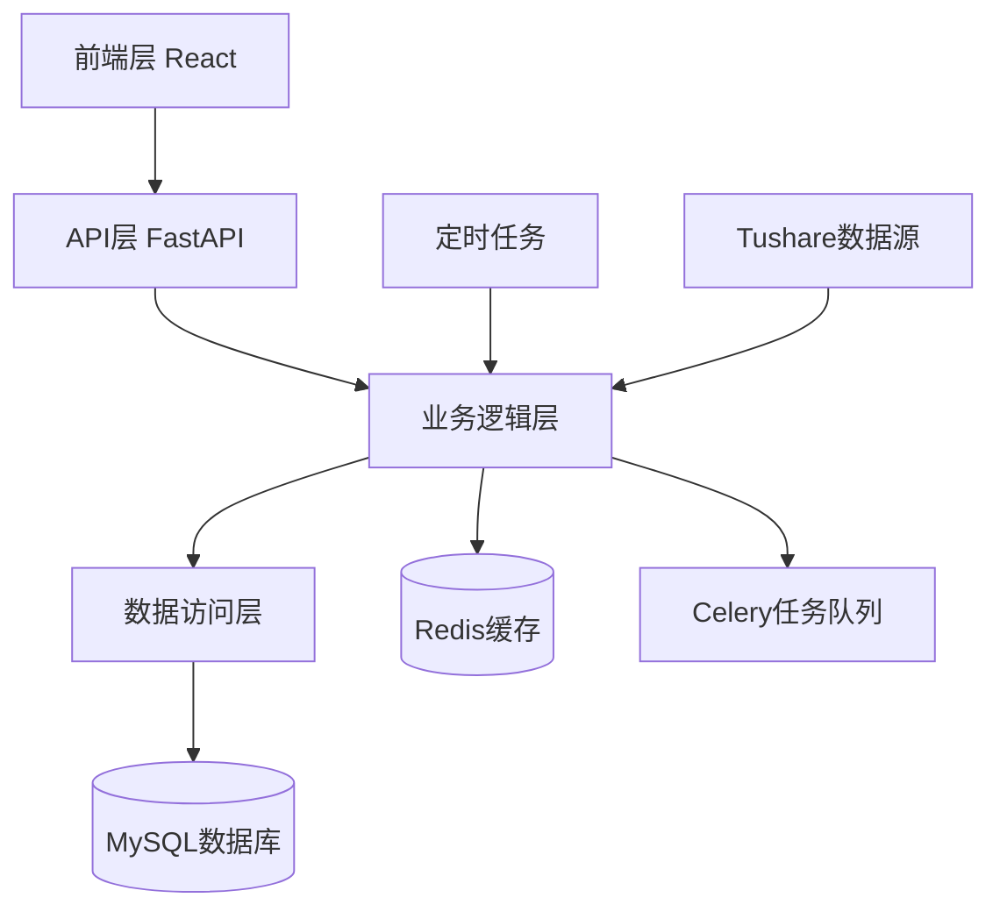

# ZQuant量化分析系统简介

## 摘要

ZQuant是一个专为个人投资者打造的开源量化分析平台，提供从数据采集、策略开发、回测分析到结果管理的一站式解决方案。系统基于FastAPI和React构建，支持Tushare数据源，内置8种策略模板，具备完整的回测引擎和绩效分析功能。ZQuant致力于降低量化分析的门槛，最小化系统成本，只需一个Tushare Token即可搭建自己的量化分析平台。

**关键词**：量化分析、回测引擎、策略管理、数据管理、开源平台

---

## 1. 系统概述

### 1.1 项目背景

随着量化投资理念的普及，越来越多的个人投资者希望使用量化工具进行投资分析和决策。然而，传统的量化平台往往存在成本高昂、功能复杂、定制困难等问题。

ZQuant应运而生，旨在为个人投资者提供一个轻量、开源、专业的量化分析平台。

### 1.2 项目愿景

> **为个人用户提供轻量、开源、专业的量化分析平台。最小化系统成本，只需Tushare的一个token，即可搭建自己的量化分析平台。**

ZQuant致力于降低量化分析的门槛，让个人投资者也能享受到专业级的量化工具，帮助用户构建属于自己的量化投资系统。

### 1.3 核心价值主张

- **开箱即用**：完整的量化分析系统，无需从零开始搭建
- **数据驱动**：集成Tushare专业数据源，自动采集和清洗股票数据
- **回测引擎**：事件驱动的回测系统，支持多种策略类型和全面的绩效分析
- **策略模板**：内置8种常用策略模板，快速上手量化分析
- **安全可靠**：基于JWT的认证和RBAC权限控制，保障系统安全
- **高性能**：基于FastAPI构建，支持异步处理和分布式任务队列

### 1.4 目标用户群体

- 个人量化研究者
- 策略开发者
- 数据分析师
- 学习量化投资的学生

---

## 2. 核心功能模块

### 2.1 数据管理模块

- **数据采集**：集成Tushare API，支持股票基础信息、日线数据、财务数据、交易日历等多种数据类型
- **数据存储**：采用分表存储策略，按股票代码分表，显著提高查询性能
- **数据清洗**：支持复权处理、交易日历处理、停牌数据填充等
- **数据服务**：提供统一的数据查询API，支持Redis缓存

### 2.2 回测引擎

- **事件驱动**：按交易日历推进，模拟真实交易环境
- **交易模拟**：支持T+1延迟撮合、涨跌停限制、交易成本计算
- **绩效分析**：提供全面的回测绩效指标，包括收益率、夏普比率、最大回撤、Alpha、Beta等

### 2.3 策略管理系统

- **策略管理**：完整的策略增删改查功能，支持策略分类和搜索
- **策略模板库**：内置8种策略模板
  - 技术分析类：简单均线、双均线、布林带、RSI
  - 基本面类：PE/PB价值策略
  - 量化策略类：动量策略、均值回归、网格交易

### 2.4 用户权限管理

- **认证功能**：基于JWT Token的无状态认证机制
- **授权功能**：基于角色的访问控制（RBAC）
- **API密钥管理**：支持API密钥认证，方便程序化调用

### 2.5 定时任务调度系统

- **灵活调度**：支持Cron表达式和间隔调度
- **实时监控**：实时查看任务执行状态和进度
- **任务编排**：支持任务依赖关系和失败处理策略

### 2.6 通知系统

支持系统通知、策略通知、回测通知等多种通知类型，提供完整的通知管理功能。

---

## 3. 技术架构

### 3.1 技术栈

**后端**：
- FastAPI - Web框架
- MySQL - 数据库
- Redis - 缓存
- Celery - 异步任务队列
- APScheduler - 定时任务调度

**前端**：
- React 19 - 前端框架
- Ant Design 5 - UI组件库
- UmiJS Max - 应用框架

### 3.2 系统架构



### 3.3 数据库设计

- **分表存储**：按股票代码分表，提高查询性能
- **数据视图**：通过数据库视图提供统一查询接口
- **表名规范**：遵循严格的表名规范（`zq_data_*`、`zq_app_*`、`zq_backtest_*`等）

---

## 4. 系统特色

### 4.1 开箱即用

提供完整的量化分析系统，包括数据库模型、策略模板库、API接口、Web管理界面等，用户只需按照文档配置环境即可快速开始使用。

### 4.2 低成本部署

- 只需Tushare的一个Token即可获取所有数据
- 完全开源，无授权费用
- 可在个人电脑或小型服务器上运行

### 4.3 分表存储优化

按股票代码分表存储，显著提高查询性能，通过数据库视图提供统一查询接口。

### 4.4 事件驱动回测

严格按照交易日历推进，模拟真实交易环境，包括T+1延迟撮合、涨跌停限制、交易成本等。

### 4.5 策略模板库

内置8种常用策略模板，用户可以直接使用或基于模板进行修改和扩展。

---

## 5. 应用场景

- **个人量化研究**：获取历史数据，开发和测试量化策略
- **策略验证和优化**：使用历史数据回测策略，优化策略参数
- **数据分析和回测**：进行数据分析和可视化，生成分析报告
- **投资决策支持**：获取实时和历史数据，分析市场趋势

---

## 6. 快速开始

### 6.1 系统要求

- Python 3.11+
- Node.js 20.0.0+
- MySQL 5.7+ 或 8.0+
- Redis 5.0+（可选）

### 6.2 安装步骤

1. **克隆项目**
```bash
git clone https://github.com/zquant/zquant.git
cd zquant
```

2. **安装依赖**
```bash
pip install -r requirements.txt
```

3. **配置环境变量**
复制 `.env.example` 为 `.env` 并配置：
- `DATABASE_URL` - MySQL数据库连接
- `REDIS_URL` - Redis连接（可选）
- `TUSHARE_TOKEN` - Tushare API Token
- `SECRET_KEY` - JWT密钥

4. **初始化数据库**
```bash
python zquant/scripts/init_db.py
python zquant/scripts/init_scheduler.py
python zquant/scripts/init_view.py
python zquant/scripts/init_strategies.py
```

5. **启动服务**
```bash
# 启动后端
uvicorn zquant.main:app --reload --host 0.0.0.0 --port 8000

# 启动前端（可选）
cd web
npm install
npm start
```

### 6.3 访问系统

- API文档：http://localhost:8000/docs
- Web界面：http://localhost:8001
- 默认账号：admin / admin123

---

## 7. 项目信息

### 7.1 开源协议

ZQuant采用 [Apache License 2.0](LICENSE) 开源协议。

### 7.2 项目地址

- **GitHub仓库**：https://github.com/zquant/zquant
- **文档网站**：https://docs.zquant.com
- **问题反馈**：https://github.com/zquant/zquant/issues

### 7.3 联系方式

- **邮箱**：kevin@vip.qq.com
- **微信**：zquant2025

### 7.4 贡献指南

我们欢迎所有形式的贡献！包括报告Bug、提出功能请求、改进文档、提交代码等。

---

## 8. 总结

ZQuant量化分析系统是一个功能完整、易于使用、成本低廉的开源量化分析平台。系统提供了从数据采集、策略开发、回测分析到结果管理的一站式解决方案，特别适合个人投资者和量化研究者使用。

### 核心优势

1. **开箱即用**：完整的系统，无需从零搭建
2. **低成本**：只需一个Tushare Token即可运行
3. **高性能**：分表存储、缓存优化，查询速度快
4. **易扩展**：模块化设计，易于定制和扩展
5. **安全可靠**：完善的权限管理和安全措施

---

**作者**：ZQuant Team  
**日期**：2025年1月  
**版本**：v0.1.0  
**许可证**：Apache License 2.0
