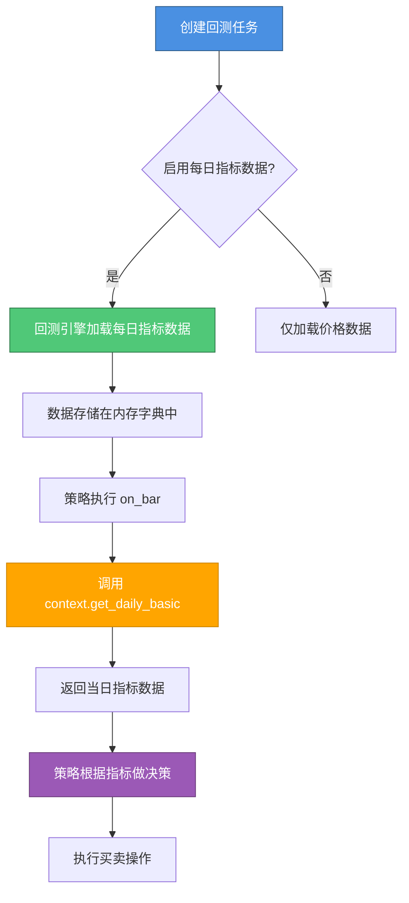

# 每日指标数据使用指南

## 📖 概述

每日指标数据功能允许策略在回测过程中访问股票的财务指标，如市盈率（PE）、市净率（PB）、换手率等。这些数据可以帮助策略进行更智能的选股和交易决策。

## 🔄 工作原理



## 📋 使用步骤

### 步骤 1：创建回测任务时启用每日指标数据

在前端创建回测任务页面，找到 **"使用每日指标数据"** 开关，将其打开：

```
┌─────────────────────────────────────┐
│  创建回测任务                        │
├─────────────────────────────────────┤
│  策略名称: [____________]           │
│  策略代码: [____________]           │
│  股票代码: [____________]           │
│  ...                                │
│  ☑ 使用每日指标数据                 │
│     (启用后，策略可通过              │
│      context.get_daily_basic()      │
│      访问 PE、PB、换手率等指标)     │
└─────────────────────────────────────┘
```

### 步骤 2：在策略代码中使用 context.get_daily_basic()

在策略的 `on_bar` 方法中，通过 `context.get_daily_basic()` 获取每日指标数据：

```python
from zquant.backtest.context import Context
from zquant.backtest.strategy import BaseStrategy

class Strategy(BaseStrategy):
    def on_bar(self, context: Context, bar_data: dict):
        for symbol, bar in bar_data.items():
            # 获取每日指标数据
            daily_basic = context.get_daily_basic(symbol)
            
            if daily_basic is None:
                # 如果未启用每日指标数据或数据不存在，跳过
                continue
            
            # 使用指标数据
            pe = daily_basic.get("pe")  # 市盈率
            pb = daily_basic.get("pb")  # 市净率
            turnover_rate = daily_basic.get("turnover_rate")  # 换手率
            
            # 根据指标做交易决策
            if pe and pe < 20 and pb and pb < 2:
                # 买入低估值股票
                context.order_target_value(symbol, 100000)
```

## 📊 可用的数据字段

`context.get_daily_basic()` 返回的字典包含以下字段：

| 字段名 | 类型 | 说明 | 示例 |
|--------|------|------|------|
| `close` | float | 收盘价 | 10.5 |
| `turnover_rate` | float | 换手率（%） | 2.5 |
| `turnover_rate_f` | float | 换手率（自由流通股，%） | 3.2 |
| `volume_ratio` | float | 量比 | 1.5 |
| `pe` | float | 市盈率（总市值/净利润） | 15.8 |
| `pe_ttm` | float | 市盈率TTM | 16.2 |
| `pb` | float | 市净率（总市值/净资产） | 2.1 |
| `ps` | float | 市销率 | 3.5 |
| `ps_ttm` | float | 市销率TTM | 3.6 |
| `dv_ratio` | float | 股息率（%） | 2.3 |
| `dv_ttm` | float | 股息率TTM（%） | 2.4 |
| `total_share` | float | 总股本（万股） | 100000 |
| `float_share` | float | 流通股本（万股） | 80000 |
| `free_share` | float | 自由流通股本（万股） | 60000 |
| `total_mv` | float | 总市值（万元） | 1000000 |
| `circ_mv` | float | 流通市值（万元） | 800000 |

## 💡 完整示例

### 示例 1：基于 PE/PB 的价值投资策略

```python
from zquant.backtest.context import Context
from zquant.backtest.strategy import BaseStrategy

class Strategy(BaseStrategy):
    """基于 PE/PB 的价值投资策略"""
    
    def initialize(self):
        self.max_pe = 30.0  # 最大市盈率
        self.max_pb = 3.0   # 最大市净率
    
    def on_bar(self, context: Context, bar_data: dict):
        for symbol, bar in bar_data.items():
            # 获取每日指标数据
            daily_basic = context.get_daily_basic(symbol)
            
            if daily_basic is None:
                continue
            
            pe = daily_basic.get("pe")
            pb = daily_basic.get("pb")
            
            # 检查数据有效性
            if pe is None or pb is None:
                continue
            if pe <= 0 or pb <= 0:
                continue
            
            # 获取当前持仓
            pos = context.portfolio.get_position(symbol)
            
            # 买入逻辑：低 PE 且低 PB
            if pe <= self.max_pe and pb <= self.max_pb and pos.quantity == 0:
                context.order_target_value(symbol, 100000)
            
            # 卖出逻辑：PE 或 PB 过高
            elif (pe > self.max_pe * 1.5 or pb > self.max_pb * 1.5) and pos.quantity > 0:
                context.order_target(symbol, 0)
```

### 示例 2：基于换手率的动量策略

```python
class Strategy(BaseStrategy):
    """基于换手率的动量策略"""
    
    def initialize(self):
        self.min_turnover = 3.0  # 最小换手率（%）
    
    def on_bar(self, context: Context, bar_data: dict):
        for symbol, bar in bar_data.items():
            daily_basic = context.get_daily_basic(symbol)
            
            if daily_basic is None:
                continue
            
            turnover_rate = daily_basic.get("turnover_rate")
            
            if turnover_rate is None:
                continue
            
            pos = context.portfolio.get_position(symbol)
            
            # 高换手率表示活跃，买入
            if turnover_rate >= self.min_turnover and pos.quantity == 0:
                context.order_target_value(symbol, 100000)
            
            # 低换手率表示不活跃，卖出
            elif turnover_rate < self.min_turnover * 0.5 and pos.quantity > 0:
                context.order_target(symbol, 0)
```

### 示例 3：查询历史日期的指标数据

```python
from datetime import date, timedelta

class Strategy(BaseStrategy):
    def on_bar(self, context: Context, bar_data: dict):
        for symbol, bar in bar_data.items():
            # 获取当前日期的指标
            today_data = context.get_daily_basic(symbol)
            
            # 获取昨天的指标（需要指定日期）
            yesterday = context.current_date - timedelta(days=1)
            yesterday_data = context.get_daily_basic(symbol, yesterday)
            
            if today_data and yesterday_data:
                # 比较 PE 变化
                pe_today = today_data.get("pe")
                pe_yesterday = yesterday_data.get("pe")
                
                if pe_today and pe_yesterday:
                    pe_change = (pe_today - pe_yesterday) / pe_yesterday
                    # 如果 PE 下降超过 10%，买入
                    if pe_change < -0.1:
                        context.order_target_value(symbol, 100000)
```

## ⚠️ 注意事项

1. **必须启用开关**：如果创建回测任务时未启用"使用每日指标数据"，`context.get_daily_basic()` 会返回 `None`。

2. **数据可能缺失**：某些股票在某些日期可能没有指标数据（如停牌、新上市等），需要做空值检查。

3. **性能考虑**：启用每日指标数据会增加数据加载时间，特别是回测时间跨度较长时。

4. **数据有效性**：某些指标可能为负数或异常值（如亏损公司的 PE），需要做合理性检查。

5. **日期参数**：如果不指定日期，默认使用当前回测日期。可以指定历史日期查询过去的数据。

## 🔍 调试技巧

如果策略没有按预期工作，可以添加日志输出：

```python
def on_bar(self, context: Context, bar_data: dict):
    for symbol, bar in bar_data.items():
        daily_basic = context.get_daily_basic(symbol)
        
        if daily_basic:
            print(f"{symbol} {context.current_date}: PE={daily_basic.get('pe')}, PB={daily_basic.get('pb')}")
        else:
            print(f"{symbol} {context.current_date}: 无每日指标数据")
```

## 📚 参考

- 完整示例策略：`zquant/strategy/examples/pe_pb_strategy.py`
- Context API 文档：`zquant/backtest/context.py`
- 回测引擎文档：`zquant/backtest/engine.py`

